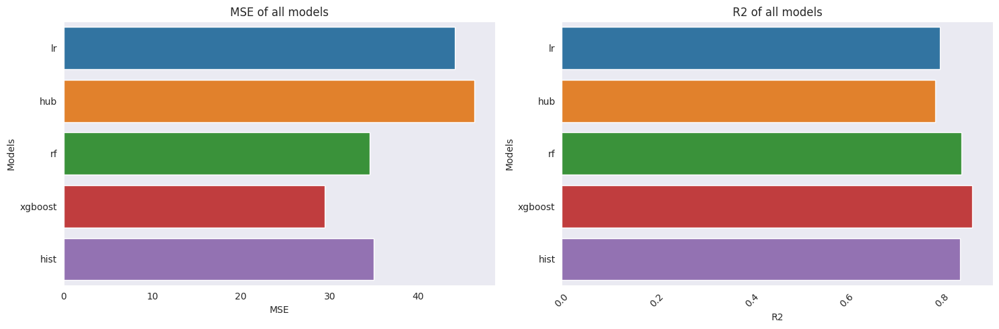

# Time to Death Prediction using MIMIC-IV

<a target="_blank" href="https://cookiecutter-data-science.drivendata.org/">
    
</a>

This project aims to predict time from hospital admission to death for critically ill patients using the MIMIC-IV dataset. The model leverages structured EHR data (diagnoses, labs, procedures, and prior admissions) and applies both regression and classification-based evaluations for explainability and clinical relevance.

## Project Organization
```
├── LICENSE            <- Open-source license if one is chosen
├── Makefile           <- Makefile with convenience commands like `make data` or `make train`
├── README.md          <- The top-level README for developers using this project.
├── data
│   ├── external       <- Data from third party sources.
│   ├── interim        <- Intermediate data that has been transformed.
│   ├── processed      <- The final, canonical data sets for modeling.
│   └── raw            <- The original, immutable data dump.
|
├── Task_1_Qualititative_data_analysis.ipynb     <- Jupyter notebook for task 1
|
|
├── Task_2_3_Modelling_Interpretatbility.ipynb   <- Jupyter notebook for task 2 and 3
│
|
├── Assumption.md      <-  Mentions the project scope, design assumptions taken to acheieve the objective (also listed below.) 
|
|
├── models             <- Trained and serialized models, model predictions, or model summaries
│
├── notebooks          <- Jupyter notebooks. Naming convention is a number (for ordering),
│                         the creator's initials, and a short `-` delimited description, e.g.
│                         `1.0-jqp-initial-data-exploration`.
│
├── pyproject.toml     <- Project configuration file with package metadata for 
│                         assessment and configuration for tools like black
|
│
├── reports            <- Generated analysis as HTML, PDF, LaTeX, etc.
│   └── figures        <- Generated graphics and figures to be used in reporting
│
├── requirements.txt   <- The requirements file for reproducing the analysis environment, e.g.
│                         generated with `pip freeze > requirements.txt`
│
├── setup.cfg          <- Configuration file for flake8
│
└── assessment   <- Source code for use in this project.
    │
    ├── __init__.py             <- Makes assessment a Python module
    │
    ├── config.py               <- Store useful variables and configuration
    │
    ├── dataset.py              <- Scripts to download or generate data
    │
    ├── features.py             <- Code to create features for modeling
```


# How to Run
Follow these steps to set up and run the project:
1. Install Requirements: 
```bash
pip install -r requirements.txt
```

2. Download MIMIC-IV Dataset: 
Request access and download the MIMIC-IV dataset from PhysioNet. Place the extracted files in the following directory:
```bash
data/raw/mimic/<version>/
```
For example:
``` bash
data/raw/mimic/2.1/
```
Make sure to update the dataset path in config.py to match your local structure.

3. Run Analysis

Run the following notebooks in sequence:

1. Task_1_EDA_and_Cohort_Creation.ipynb
→ Cohort definition, descriptive statistics, and visualizations.

2. Task_2_3_Modeling_Interpretability.ipynb
→ Feature creation, model training, and time-to-death prediction.
→ Post-hoc analysis, classification metrics, SHAP explanations.


# Problem Definition

We predict time_to_death for each patient during their final hospital admission (where hospital_expire_flag = 1):

`time_to_death` = `deathtime` - `admittime`  
This is done only for the final admission only

## Significance:
1. **Relevance**: High! This aligns perfectly with assessing the severity and expected course of the illness episode that ultimately led to death.
2. **Interpretability**: High!, For a patient admitted in this critical state, how long did they survive within this hospital stay? This answers is a direct, meaningful question.
3. **Actionability**: Moderate: Predicting time of death can directly inform clinical decisions during that admission (e.g., goals of care discussions, resource intensity, palliative care involvement).


# Cohort Selection:

1. Patients with known death dates during hospitalization (hospital_expire_flag = 1)
2. Prediction anchored at the final hospital admission
3. Historical features generated from prior admissions only. This is done to avoid data leakage.

# Assumptions:

As part of this project, I made several design decisions and assumptions to define the scope, construct the dataset, and guide modeling. These were necessary for practical implementation:

1. **Defining Time-to-Death**:<br>
I chose to model `time to death` as _the duration between hospital admission and in-hospital death during the final hospital stay_. This decision allowed for a clear, timestamp-based outcome variable with a real clinical significence.<br>
2. **Focusing on In-Hospital Deaths**:<br>
I limited the cohort to patients who died during their final hospital admission (i.e., hospital_expire_flag = 1). This excluded patients who were discharged (alive) or died outside the hospital, as their time of death may be uncertain or unavailable.<br>
3. **Choosing Anchor Age as a Proxy for Patient Age**:<br>
In MIMIC-IV, patient age is masked for privacy protection and the exact age at admission isn’t always directly available. To address this, I used the anchor_age field from the patients table as a proxy for patient age throughout the analysis. <br>
4. **Clinical Feature Engineering Based on Best Judgment**<br>
When defining condition flags (e.g., for CHF, diabetes, CKD, cancer) and selecting lab values (e.g., glucose, hemoglobin, sodium), I relied on my clinical intuition and my knowledge from similar mortality prediction studies. However, I am not a clinical expert, and these decisions were made to the best of my judgment based on interpretability and potential clinical relevance. <br>
5. **Referencing External Guidelines for Grouping Categorical Variables**:<br>
For high-cardinality categorical variables like `race` and `admission type`, I referred to best practices published in healthcare analytics communities and academic blogs. Specifically:
    1. I grouped race categories into broader bins based on this reference [Racial Disparities .... MIMIC-IV](https://pmc.ncbi.nlm.nih.gov/articles/PMC10524813/#s1:~:text=of%20Stay%20Criteria.-,Asian,Demographics,-Age%2C%20years%2C%20median) on race grouping best practices to reduce noise and improve model generalizability.

    2. For admission types, I consolidated granular labels (e.g., EU OBSERVATION, DIRECT EMER., OBSERVATION ADMIT) into standardized categories (e.g., Emergency, Elective) based on usage frequency and guidelines like this one [Swiss Physician's mapping approach](https://github.com/MIT-LCP/mimic-code/discussions/1215).<br>

6. **Using Prior Admissions as Patient History**:
To enrich patient context, I incorporated data from previous hospital admissions (before the final admission to avoid leakage). This historical information was used to compute comorbidity scores, flag chronic conditions, and analyze longitudinal lab patterns. <br>
7. **Imputing Missing Values with Flags**:
For features like `"time_since_first_diagnosis_CANCER_ICD_CODES"`, `"time_since_first_diagnosis_STROKE_ICD_CODES`...." I used zero imputation alongside a binary flag `had_cancer`, `had_storke` to indicating whether the value was missing. I assumed that missingness might reflect clinical absence (e.g., never diagnosed) rather than random noise.<br>
8. **Evaluating Regression as Classification**
Although my models predict a continuous time-to-death, I also evaluated them using classification metrics like AUC, precision, recall, and F1 by defining thresholds (e.g., “death within X days”). This made performance easier to interpret in a clinical risk stratification context. <br>


# Feature Engineering:
1. **Static features**: Age, gender, insurance, admission type
2. **Diagnosis features**: Stats vars of diagnosis, condition flags (stroke, cancer, etc.), time since first diagnosis of <ICD_CODE> in years, etc.
3. **Lab features**: Summaries (mean, max, std) for labs (e.g., lactate, sodium), abnormal readings across all prior admission.
4. **Longitudinal Lab features** (Critical): Summaries of patient's labevents readings across 7, 30, 90, 180, 365-day windows 
5. **Event counts**: Hospital frequencies.
6. **Transformation**: Log/square/PCA transformation applied to skewed numeric values


# Modeling Workflow
Regress time_to_death (in days) using linear & ensemble models (e.g., Linear regression, Huber Regression, XGBoost, Random Forest, etc.)

## Post-hoc classification:
1. Convert y_true to death_within_X_days binary labels. X can be any days (3,7,14,30...)
2. Evaluate classification metrics: AUC, precision, recall, F1, confusion matrix

## Explainability:
1. Feature importance plots
2. SHAP values for local/global explanations

# Model Performance:


XGBoost had the best performance. 
- MSE:  29.433
- R2: 0.86379

# Files of interests:
1. [Task_1_Qualititative_data_analysis.ipynb](Task_1_Qualititative_data_analysis.ipynb)
2. [Task_2_3_Modelling_Interpretatbility.ipynb](Task_2_3_Modelling_Interpretatbility.ipynb)


